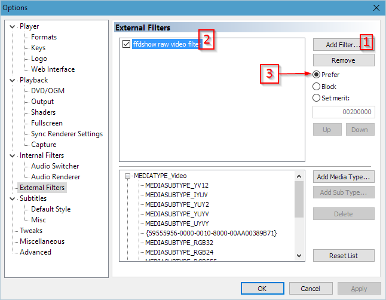

# Setting Up mpc-hc with madVR and SVP

## Downloads

1. [Media Player Classic Homecinema (v1.7.13)](https://mpc-hc.org/downloads/) 32 or 64 bit (either works)
2. [madVR (v0.92.12)](http://madvr.com/)
3. [SVP (4.2.0.122)](https://www.svp-team.com/wiki/Download)
4. [ffdshow tryouts (1.3.4531)](http://ffdshow-tryout.sourceforge.net/download.php)

## Setup

1. Install all of them, then start mpc-hc and set its output to madVR:
   
   
   
2. Configure madVR:
   1. Play any file and find the madVR icon in the Notification Area. Right click on it
      and select `Edit madVR Settings...`
   
      
   
   2. chroma upscaling - Jinc with anti-ringing:
   
      
   
   3. image downscaling - Jinc with anti-ringing:
   
      
   
   4. image upscaling - Jinc (no filters)
   
      
   
   5. rendering settings:
   
      

      

      

3. Configure ffdshow raw video filter in mpc-hc:
   
   

4. Test that it works - open any video and notice the ffdshow and the madVR notification area icons
   
   

5. Just start SVP, should notice the SVP logo appear in mpc-hc:
   
   
